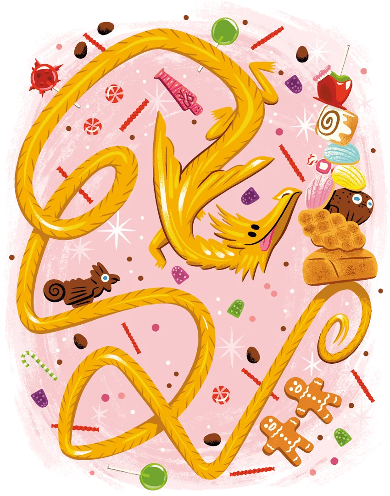
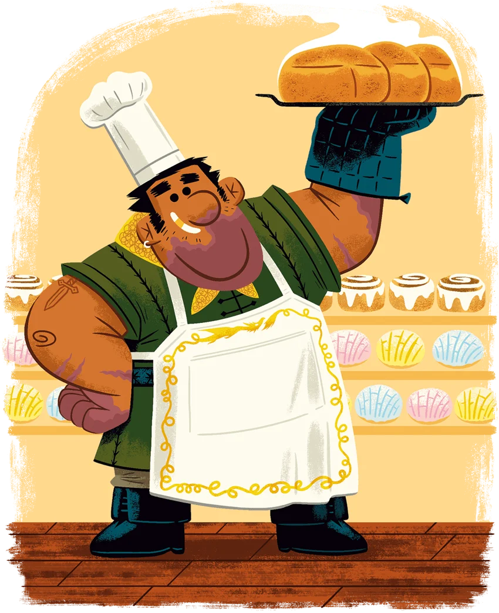
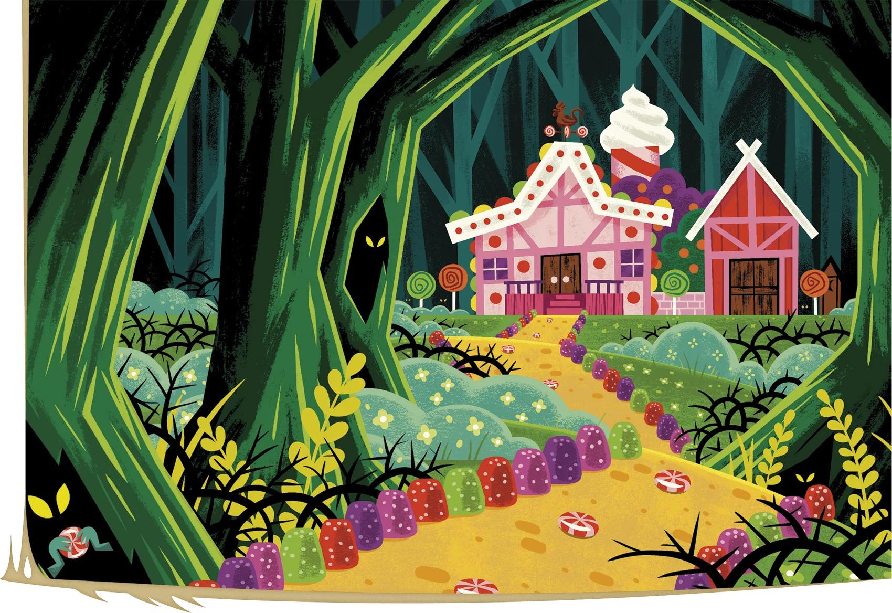

The party receives a description of the events going down at the [Tree of Knowledge](../Locations/Prismeer/Tree%20of%20Knowledge.md): a Gold Dragon (allegedly named Briochebane) circles the tree, on apparent lookout, while [Skibidi Toilet](../Characters/NPCs/Hourglass%20Coven/Skibidi%20Toilet.md) hacks at the tree with the [Iggwilv's Flametongue Sword](../Misc/Iggwilv's%20Flametongue%20Sword.md), attempting to topple it...

Looking into the Pokeball we own, [Azargon](../Characters/Azargon%20Magna.md) notices... it somehow contains [Soren](../Characters/Soren.md)?
[Azargon](../Characters/Azargon%20Magna.md) admits that he forgot that his companion was in there, but encourages his friend to escape the crystal given the... dire vision they just received.
They catch him up to speed, and attempt to plan an approach to this treacherous scenario.

### Preventing the Arson

The plan is as follows:
1. The entire party smoke-clouds, and stays on the dragon, excluding [Soren](../Characters/Soren.md), who directly Dimension Doors onto the dragon to convince her.
2. The party waits for [Soren](../Characters/Soren.md)'s signal to dive-bomb the hag, if things are (or aren't) going well.
3. They party lays a rapid beatdown upon the hag, before she can deal too much damage to them (or to the dragon, if Soren can convince it that burning down the [Tree of Knowledge](../Locations/Prismeer/Tree%20of%20Knowledge.md) is an evil thing to be doing).

Soren's song momentarily reminds the dragon of her separation from "Phil", but it's only a temporary effect. During her temporary lucidity, the dragon breathes her breath weapon upon the hag's adds, killing them all instantly. The hag notices that something terrible has happened, but the rest of the party takes the eruption of sound from the start of combat as their signal to drop.

The hag, coward she is, Dimension Doors away from us after taking an intense beatdown by [Leroux](../Characters/Leroux%20Whitelaw.md), driving her directly to near-death within 6 seconds. After she does, she morphs into a beautiful painting, showing a young [Doc](../Characters/Fionn%20Drake.md)-looking child meeting with a young black-haired child... she calls [Doc](../Characters/Fionn%20Drake.md) by his real name, concerning him greatly and confusing the rest of the party. This painting then disapparates.
### Stopping the Dragon

Amidst this chaos, [Soren](../Characters/Soren.md) reminds the party that the dragon can re-light the tree with its fire breath, and that it could be possible to dispel whatever magic affects it. Putting his concerns aside, [Doc](../Characters/Fionn%20Drake.md) dispels the magic upon the dragon, whom loses her mind. She then attempts to propel herself directly into the tree, crying out for "Phil", while [Soren](../Characters/Soren.md) attempts to convince her **not** to destroy the tree, though he burns a legendary resistance to try to rend the [Tree of Knowledge](../Locations/Prismeer/Tree%20of%20Knowledge.md) out of existence.
Crashing into the tree ([Soren](../Characters/Soren.md) hanging on, barely), she immediately gives up, appearing to be in despair.

[Azargon](../Characters/Azargon%20Magna.md) and [Leroux](../Characters/Leroux%20Whitelaw.md) notice a painting, located inside the now-smashed area of the tree (which they believe to always have been there), depicting a candy cottage, with a young-looking golden dragon making some sort of bargain with [Skibidi Toilet](../Characters/NPCs/Hourglass%20Coven/Skibidi%20Toilet.md).

---
### Turning into Plebians

When the party comes to, they smell smoke and find themselves in [[Hubbleton]].
Down the well-worn dirt roads, we see a bunch of farmers, crafters, and lumberjacks gathered around panicking: they are yelling "someone's inside!".
There is an older voice from within the burning candy shop, saying "heelp! help me!!", like that video with the Dairy Queen guy.
Soren, in his new form as some type of fairy, manages to put out one half of the home, and then Leroux in his heroic new form dives into the flames, rescues the old woman, and makes it out alive. Azargon, in his new form, manages to control the water that Soren produced, fully putting out the shop afterwards. Doc's new form manages to uncork 4 gallons of beer and do not much else. 

Investigating the pre-made hole, [Leroux](../Characters/Leroux%20Whitelaw.md) and [Doc](../Characters/Fionn%20Drake.md) are able to find a scorched cinnamon bun and a scorched family portrait. It appears to resemble the old lady (when she was much younger, perhaps a baby) they found inside, alongside another young child, perhaps a boy.

Outside during this investigation, [Soren](../Characters/Soren.md) and [Azargon](../Characters/Azargon%20Magna.md) calm the crowd outside and look for any intelligence they may have. One (slightly insane-seeming) villager is pointing at the fire aggressively, insisting that it is foul play and was caused by a turtle. She says it "used its magical abilities" to "bite fire into existence". It "was an evil turtle indeed", but also "spectral and ghostly". Hearing this hogwash, [Soren](../Characters/Soren.md) casts Zone of Truth on the crowd to aid in the investigation. Upon this cast, the woman falls to the ground, intoxicated, and [Soren](../Characters/Soren.md) begins a more systematic investigation, interrogating each of the villagers in turn. Upon further investigation under the zone, they reveal that a strange woodland Golden Lizard ran from the woods and directly struck the cabin, from their observation. The lizard appears to love cinnamon buns, and always went to a local baker named "Phil" is known to produce the best cinnamon buns in town...
The party assures the old woman, named Edith Applegart, that they will find justice for her. They decide that searching for this other sweets baker, named "Phil", would be the best possible course of action.

### The Cinnamon Bun Store

Heading down, just a little down the road, they find a cottage with a scenic smokestack rising out of it. There is a sign outside that says ""Phil"'s Bakery". Heading inside, [Soren](../Characters/Soren.md) sees sunlight filtering through the window, beautiful pastries and delicious-smelling cinnamon rolls line the walls. A dwarf with bushy eyebrows exits the kitchen, stocking the shelves with delicious-looking confections. 

They interrogate the man, [Soren](../Characters/Soren.md) playing good cop, [Doc](../Characters/Fionn%20Drake.md) playing bad cop, [Azargon](../Characters/Azargon%20Magna.md) playing "casting the friends spells and creating phlegm replicas of gold dragons that we are looking for that he appears to know more about".
He says that Briochebane is basically his child, and he is the reason the cinnamon buns are so good, as he knows a "special way" to replicate the fire. He likes to keep Briochebane a secret, since kids have been going missing around the village.

Eventually, [Soren](../Characters/Soren.md) is able to convince Phil to admit that Briochebane is a "special gold dragon" and that he used to be a bandit of sorts (whom it turns out that the party has heard of). One day, when his party were robbing a vault precariously, they found a dragon egg and accidentally turned into his child when he hatched the egg. He believes that Bahamut blessed him with Briochebun as a blessing to improve his life and give him a second chance, and he fears that if people learn about the dragon that he would be taken away by the army, or thieves.
He thinks that Briochebane has gone north, and that he should help repair that old woman's store, but [Soren](../Characters/Soren.md) tries to convince him to come with the party instead.

### Heading North to find the Dragon

Beyond Hubbleton spreads a dense forest, thick of trees covered in moss with dangling branches.
After 20 or so minutes, Phil leads us to the trail dotted with coloured candy gumdrops...

The party, as usual, begins to fight about who is the fattest one in the party currently (in their new bodies) is, after Phil draws attention to "his big ol' tankard" when questioned about why he hasn't gone to this area. Common argument.

The candy trail ends at a sprawling cottage deep in the woods, a melody of sweet smells wafting from it. A lot of candies decorate its exterior, and the whole thing is entirely made of candy. A peppermint tower rises in the back, and a red barn lies near the edge of the forest in the east, and an outhouse structured of candy exists in the north.

Phil notes that the candy around them looks similar to that manufactured by Edith... how interesting. The party finds a half-eaten cinnamon bun just outside the front door and that the "fruit leather" rug in front of the door appears to be alive.
Being ambushed by a fruit leather Rug of Smothering (and then having goblin [Azargon](../Characters/Azargon%20Magna.md) immediately eat it to death), they realize that the occupants of this house are for sure hostile... they convince Phil not to eat some of the very delicious-looking candy.
The hallway ahead, lined with flour, contains a hidden peppermint tile trap, which goblin [Azargon](../Characters/Azargon%20Magna.md) triggers while being irate about being made fun of for his voice: a blast of candy flies through the air, striking the party for 14 bludgeoning damage on a failed save. Those who failed are also knocked prone and turned into candy. [Soren](../Characters/Soren.md) now becomes... a gingerbread fairy...